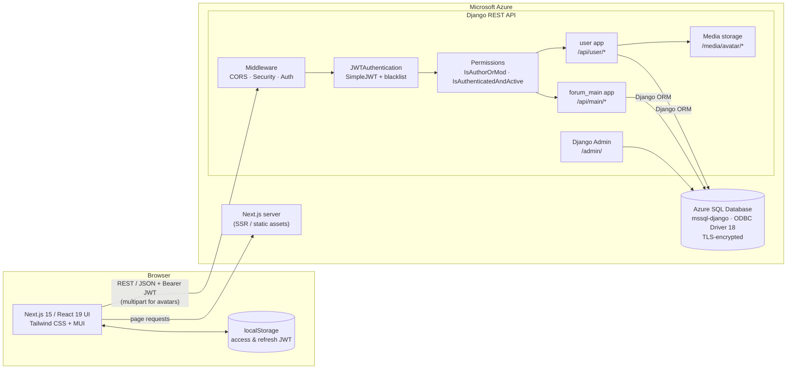
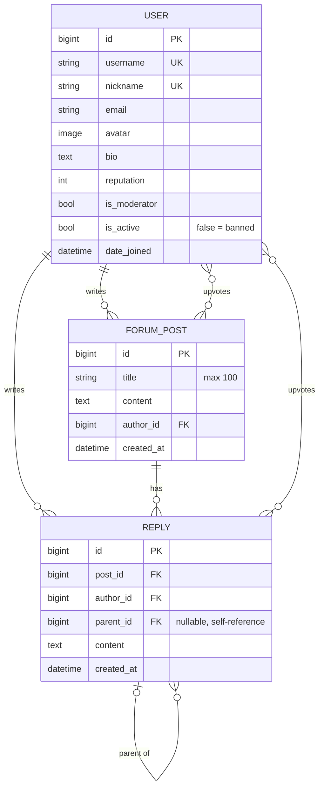

# GameForum: Full-Stack Community Forum on Azure

GameForum is a full-stack discussion forum for gamers. It has a **Next.js / React** frontend, a **Django REST Framework** API, and a managed **Azure SQL Database**, and the whole system is deployed on **Microsoft Azure**.

It was built by a three-person team as the group project for **INFS803** during our Master's programme (2025). The team split the work into three parts: backend API, frontend, and cloud database.

---

## Table of Contents

- [Features](#features)
- [Tech Stack](#tech-stack)
- [System Architecture](#system-architecture)
- [Technical Highlights](#technical-highlights)
- [Data Model](#data-model)
- [API Reference](#api-reference)
- [Project Structure](#project-structure)
- [Getting Started (Local Development)](#getting-started-local-development)
- [Testing](#testing)
- [Team & Contributions](#team--contributions)
- [Known Limitations & Future Work](#known-limitations--future-work)

---

## Features

**Accounts & profiles**
- Users can register, log in, and log out with JWT access and refresh tokens. Logging out blacklists the refresh token on the server.
- Users can edit their profile (nickname, email, name, password) and upload an avatar with a live preview. The client checks the file type and a 5 MB size limit.
- Every user has a public profile page that lists their posts.

**Posts & discussions**
- Users can create, edit, and delete posts. Only the author or a moderator can edit or delete a post.
- Replies are threaded: a user can reply to a post or to another reply, and the UI shows the replies as a nested tree.
- Upvotes work as a toggle on both posts and replies. Each user can upvote an item once, and a second call removes the upvote.

**Discovery**
- The home feed has two views: **Latest** (most recent reply activity) and **Popular** (most upvotes).
- The paginated post list can be sorted by upvotes, reply count, or latest reply time, in either direction.
- Full-text search covers post titles and content.

**Moderation**
- Moderators (`is_moderator`) can edit or delete any post or reply.
- Admins can ban a user by setting `is_active = False`. Banned users can still browse, but they cannot post, reply, or upvote.
- The Django Admin panel has a customised user management screen.

---

## Tech Stack

| Layer | Technology |
|---|---|
| **Frontend** | Next.js 15 (App Router, Turbopack), React 19, Tailwind CSS 4, Material UI 7 (MUI), Emotion |
| **Backend** | Python, Django, Django REST Framework, `djangorestframework-simplejwt` (with token blacklist), `django-cors-headers`, `django-environ`, Pillow |
| **Database** | Azure SQL Database (Microsoft SQL Server), accessed through `mssql-django`, `pyodbc`, and ODBC Driver 18 over an encrypted connection. SQLite is available for local development. |
| **Auth** | Stateless JWT (Bearer tokens) with refresh-token rotation and blacklisting |
| **Cloud** | Microsoft Azure (frontend, backend API, and managed SQL database) |
| **Tooling** | Git / GitHub (feature branches + pull requests), ESLint, DRF Browsable API, cURL test scripts |

---

## System Architecture



### Request lifecycle

1. The React UI calls the API through one service layer (`src/app/services/apiService.js`). That layer adds `Authorization: Bearer <access_token>` to every request.
2. Django's CORS middleware checks the frontend origin. `JWTAuthentication` then turns the token into a `request.user`.
3. Each view declares its own permission classes:
   - `AllowAny` for public reads.
   - `IsAuthenticated` for member-only reads.
   - `IsAuthenticatedAndActive` for writes, which blocks banned users.
   - The object-level `IsAuthorOrMod` check for edits and deletes.
4. DRF serializers validate the input. The Django ORM builds the SQL (including annotations for sorting) and runs it on Azure SQL Database.
5. List endpoints return paginated JSON (`PageNumberPagination`, 20 items per page).
6. If the access token has expired, the API returns `401`. The frontend then uses the refresh token to get a new access token and replays the original request, so the user never sees the failure.

---

## Technical Highlights

### Backend (Django REST Framework)

- **Custom user model.** `user.User` extends `AbstractUser` and adds `nickname` (unique display name), `avatar`, `bio`, `reputation`, and `is_moderator`. The model is registered through `AUTH_USER_MODEL` from the start, so there was never a migration off Django's default `User`.
- **JWT security settings.** Access tokens last 4 hours and refresh tokens last 7 days. `ROTATE_REFRESH_TOKENS` and `BLACKLIST_AFTER_ROTATION` are enabled. Logout adds the refresh token to the blacklist, and the tests check that a logged-out token can no longer be refreshed.
- **Role-based authorisation with custom permission classes.**
  - `IsAuthorOrMod` is an object-level permission. Anyone can use safe methods, but only the author or a moderator can modify an object.
  - `IsAuthenticatedAndActive` reuses Django's built-in `is_active` flag as a ban switch, so no extra table is needed.
- **Idempotent upvote toggling.** Upvotes are stored as a `ManyToManyField` (`upvoted_by`) instead of a counter column. This rules out duplicate votes at the data level, lets one endpoint handle both upvote and un-upvote, and computes the count from the relation.
- **Threaded replies.** Each `Reply` has a nullable self-referencing `parent` foreign key. The serializer adds `parent_author` and `parent_content`, so the client can show a quoted context without extra requests.
- **Database-side sorting.** `SortedPostListView` annotates the queryset with `Count('replies')`, `Max('replies__created_at')`, and `Count('upvoted_by')`. It then exposes those fields through DRF's `OrderingFilter`, so the sorting runs in SQL instead of Python.
- **Search.** DRF's `SearchFilter` searches `title` and `content`.
- **Validation.** Serializers enforce the input rules:
  - Usernames must be alphanumeric, 4–20 characters, and unique.
  - Passwords must be at least 6 characters (at least 8 when changed later).
  - Nickname and email must be unique on profile update.
- **Collision-free avatar uploads.** Files are stored as `avatar/<username>/<uuid4>.<ext>`. `UserUpdateView` accepts both JSON and `multipart/form-data`.
- **Cloud database integration.** The ORM connects to Azure SQL Database through `mssql-django` and ODBC Driver 18 with encryption on. Setup instructions for both macOS and Windows are in `forum/AzureSQL_DB_Help.txt`.

### Frontend (Next.js)

- **App Router with dynamic routes:**
  - `/` — home feed.
  - `/posts` — paginated and sortable post list.
  - `/posts/[id]` — post detail with the reply tree.
  - `/posts/create` — new post form.
  - `/posts/search?q=` — search results. The query lives in the URL, so results can be bookmarked.
  - `/profile/[[...id]]` — an optional catch-all route. It shows your own profile without an ID and another user's profile with one.
- **Central API client.** One `fetchAPI` wrapper handles base-URL resolution (`NEXT_PUBLIC_API_URL`, with a config-file fallback), auth headers, error normalisation, and **automatic token refresh with request replay**. Multipart and `DELETE` requests have their own handlers.
- **Reply tree from a flat list.** The API returns replies as a flat list. The post page builds the nested tree in O(n) using an `id → node` map, then renders it recursively, with both a modal and an inline reply form.
- **UI and UX:**
  - Upvote buttons update the count immediately while the request runs.
  - Skeleton loaders show while content loads.
  - Empty and error states have their own screens, with a retry option.
  - Dates are shown as relative times.
  - Tailwind handles the responsive dark theme, and MUI provides the login/register modal. Both share one colour palette.
- **Error handling.** DRF validation errors are mapped back to the matching form fields.

---

## Data Model



When a user is deleted, their posts and replies are deleted with them. When a post is deleted, all its replies are deleted too.

---

## API Reference

All endpoints return JSON. Authenticated requests need the header `Authorization: Bearer <access_token>`. List endpoints are paginated (`?page=<n>`, 20 per page) and return `{ count, next, previous, results }`.

**Access levels**

| Level | Meaning |
|---|---|
| 🌐 **Public** | No authentication required |
| 🔑 **Authenticated** | Valid access token required |
| ✅ **Active** | Authenticated **and** `is_active = True` (not banned) |
| 🛡️ **Owner / Mod** | The object's author **or** a moderator |

### 1. Authentication — `/api/user/`

| Method | Endpoint | Access | Description |
|---|---|---|---|
| `POST` | `/api/user/register/` | 🌐 Public | Create an account. Required: `username`, `password`, `nickname`. Optional: `email`, `first_name`, `last_name`, `avatar`. |
| `POST` | `/api/user/login/` | 🌐 Public | Exchange `username` and `password` for an `access` and `refresh` token pair. |
| `POST` | `/api/user/login/refresh/` | 🔑 Refresh token | Send `{ "refresh": ... }` to get a new access token. The refresh token is rotated. |
| `POST` | `/api/user/logout/` | 🔑 Authenticated | Send `{ "refresh": ... }` to blacklist the refresh token. Returns `205 Reset Content`. |

### 2. Users — `/api/user/`

| Method | Endpoint | Access | Description |
|---|---|---|---|
| `GET` | `/api/user/current/` | 🔑 Authenticated | Get the profile of the logged-in user. |
| `GET` `PUT` `PATCH` | `/api/user/update/` | 🔑 Authenticated | View or update your own email, first/last name, nickname, password, and avatar. Accepts JSON or `multipart/form-data`. |
| `GET` | `/api/user/list/` | 🔑 Authenticated | List all users (paginated). |
| `GET` | `/api/user/get/<user_id>/` | 🔑 Authenticated | Get one user's public profile. |

### 3. Posts — `/api/main/post/`

| Method | Endpoint | Access | Description |
|---|---|---|---|
| `GET` | `/api/main/post/` | 🌐 Public | List all posts, newest first (paginated). |
| `GET` | `/api/main/post/<post_id>/` | 🌐 Public | Get one post with its embedded author. Replies are not included. |
| `POST` | `/api/main/post/create/` | ✅ Active | Create a post with `{ "title", "content" }`. |
| `PUT` `PATCH` | `/api/main/post/edit/<post_id>/` | 🛡️ Owner / Mod | Edit a post. |
| `DELETE` | `/api/main/post/delete/<post_id>/` | 🛡️ Owner / Mod | Delete a post and its replies. |
| `GET` | `/api/main/post/user/current/` | 🔑 Authenticated | List the logged-in user's posts. |
| `GET` | `/api/main/post/user/<user_id>/` | 🔑 Authenticated | List one user's posts. Returns `404` if the user doesn't exist. |

### 4. Discovery & Engagement — `/api/main/post/`

| Method | Endpoint | Access | Description |
|---|---|---|---|
| `GET` | `/api/main/post/sorted/?ordering=<field>` | 🌐 Public | List posts in a chosen order. `<field>` can be `upvotes`, `reply_count`, or `latest_reply_time`. Add a `-` prefix for descending order. Fields can be combined with commas, e.g. `?ordering=-upvotes,-reply_count`. The default is `-upvotes`. |
| `GET` | `/api/main/post/search/?search=<query>` | 🔑 Authenticated | Search post titles and content. |
| `POST` | `/api/main/post/upvote/<post_id>/` | ✅ Active | Toggle your upvote on a post. Calling it on a post you already upvoted removes the upvote. Returns `{ upvotes_count, upvoted }`. |

### 5. Replies — `/api/main/post/`

| Method | Endpoint | Access | Description |
|---|---|---|---|
| `GET` | `/api/main/post/<post_id>/reply/` | 🌐 Public | List all replies to a post, oldest first. Each reply includes `parent`, `parent_author`, and `parent_content`. |
| `POST` | `/api/main/post/<post_id>/reply/create/` | ✅ Active | Reply to a post with `{ "content" }`. |
| `POST` | `/api/main/post/<post_id>/reply/create/<reply_id>/` | ✅ Active | Reply to another reply (threaded). |
| `PUT` `PATCH` | `/api/main/post/reply/edit/<reply_id>/` | 🛡️ Owner / Mod | Edit a reply. |
| `DELETE` | `/api/main/post/reply/delete/<reply_id>/` | 🛡️ Owner / Mod | Delete a reply. |
| `POST` | `/api/main/post/reply/upvote/<reply_id>/` | ✅ Active | Toggle your upvote on a reply. Returns `{ upvotes, upvoted }`. |

### 6. Other

| Endpoint | Description |
|---|---|
| `/admin/` | Django Admin for user management, moderator assignment, and banning (staff only). |
| `/media/avatar/...` | Uploaded user avatars. |

**Example**

```bash
# Log in and grab the tokens
curl -X POST http://127.0.0.1:8000/api/user/login/ \
  -H "Content-Type: application/json" \
  -d '{"username": "alice", "password": "Secret123!"}'

# Create a post
curl -X POST http://127.0.0.1:8000/api/main/post/create/ \
  -H "Content-Type: application/json" \
  -H "Authorization: Bearer $ACCESS_TOKEN" \
  -d '{"title": "Best RPGs of 2025?", "content": "Share your picks!"}'
```

More cURL examples are in [`forum/forum_main/curl_test_commands.txt`](forum/forum_main/curl_test_commands.txt).

---

## Project Structure

```
INFS803_Group5_2025/
├── forum/                          # Django backend
│   ├── forum/                      # Project config
│   │   ├── settings.py             # DRF, SimpleJWT, CORS, pagination, Azure SQL connection
│   │   └── urls.py                 # /admin, /api/user, /api/main, media
│   ├── user/                       # Accounts app
│   │   ├── models.py               # Custom User model (nickname, avatar, is_moderator, ...)
│   │   ├── serializers.py          # Register / update / read serializers + validation
│   │   ├── views.py                # Register, logout (blacklist), profile, user lookup
│   │   ├── admin.py                # Customised Django Admin
│   │   └── tests.py                # Auth flow & profile update API tests
│   ├── forum_main/                 # Forum app
│   │   ├── models.py               # ForumPost, Reply (threaded, M2M upvotes)
│   │   ├── permissions.py          # IsAuthorOrMod, IsAuthenticatedAndActive
│   │   ├── serializers.py          # Post / Reply serializers with nested author
│   │   ├── views.py                # CRUD, upvote toggles, sort, search
│   │   └── migrations/
│   ├── media/avatar/               # Uploaded avatars (default.png)
│   ├── AzureSQL_DB_Help.txt        # Azure SQL / ODBC setup guide (macOS & Windows)
│   └── manage.py
└── react-frontend/forum/           # Next.js frontend
    ├── src/
    │   ├── app/
    │   │   ├── page.js             # Home feed (Latest / Popular)
    │   │   ├── posts/              # List, [id] detail, create, search
    │   │   ├── profile/[[...id]]/  # Own / other user profile, edit modals
    │   │   └── services/apiService.js  # API client with JWT refresh & retry
    │   ├── components/             # NavBar, AuthModal (MUI), Card, PostRow, Footer
    │   └── backendDomain.js        # Backend base URL fallback
    ├── tailwind.config.js
    └── package.json
```

---

## Getting Started (Local Development)

### Prerequisites

- Python 3.11+
- Node.js 18.18+ and npm
- For SQL Server / Azure SQL: [Microsoft ODBC Driver 18 for SQL Server](https://learn.microsoft.com/en-us/sql/connect/odbc/download-odbc-driver-for-sql-server)

### 1. Backend

```bash
cd forum
python -m venv venv
# macOS/Linux: source venv/bin/activate    Windows: .\venv\Scripts\activate

pip install django djangorestframework djangorestframework-simplejwt \
            django-cors-headers django-environ Pillow mssql-django pyodbc
```

**Configure the database.** `settings.py` reads the SQL Server connection details from environment variables through `django-environ`. Put them in `forum/.env`, which is already git-ignored:

```env
DB_NAME=<database name>
DB_USER=<sql login>
DB_PASSWORD=<password>
DB_HOST=<server>.database.windows.net
DB_PORT=1433
```

For a quick local run without SQL Server, switch `DATABASES` in `forum/forum/settings.py` to the commented-out SQLite configuration.

Then add the frontend origin (e.g. `http://localhost:3000`) to `CORS_ALLOWED_ORIGINS` and run:

```bash
python manage.py makemigrations user forum_main
python manage.py migrate
python manage.py createsuperuser   # optional: access /admin to assign moderators
python manage.py runserver         # http://127.0.0.1:8000
```

### 2. Frontend

```bash
cd react-frontend/forum
npm install
npm run dev        # http://localhost:3000
```

To point the frontend at a different backend, set the `NEXT_PUBLIC_API_URL` environment variable, or edit `src/backendDomain.js`. For a production build:

```bash
npm run build
npm run start
```

---

## Testing

The backend has DRF `APITestCase` suites. They run against a temporary test database:

```bash
cd forum
python manage.py test
```

The tests cover:
- Registration: `201` response, and the password is never returned.
- Login: returns an access/refresh token pair.
- Logout: a blacklisted refresh token is rejected with `401`.
- Profile updates through JSON and through a multipart avatar upload.

Post, reply, upvote, sort, and search endpoints were tested manually with the cURL scripts in `forum_main/curl_test_commands.txt` and the DRF Browsable API.

---

## Team & Contributions

The team used feature branches (`peter-backend`, `yuchen-frontend`, `Tyler`) and merged into `main` through GitHub pull requests.

| Member | Role | Key Contributions |
|---|---|---|
| **Peter Liu**<br/>[@Litvy9k](https://github.com/Litvy9k) | **Backend Engineer** — Django REST API | <ul><li>Set up the Django project and designed the custom `User` model.</li><li>Built the full authentication system: registration with validation, JWT login and refresh, refresh-token rotation, and logout via token blacklisting.</li><li>Built profile management with multipart avatar upload, plus user lookup and listing endpoints.</li><li>Designed the `ForumPost` and `Reply` models, including threaded replies and M2M upvotes.</li><li>Implemented post and reply CRUD, idempotent upvote toggling, SQL-annotated sorting, search, and per-user post feeds.</li><li>Wrote the custom permission classes (`IsAuthorOrMod`, `IsAuthenticatedAndActive`) for the moderator and ban system.</li><li>Configured the customised Django Admin.</li><li>Wrote the API test suite and cURL test scripts, and documented the API.</li><li>Adjusted the API during frontend integration, e.g. embedding author data in post responses.</li></ul> |
| **Yuchen Bao**<br/>[@Crp28](https://github.com/Crp28) | **Frontend Engineer** — Next.js / React | <ul><li>Built the entire Next.js 15 / React 19 frontend.</li><li>Designed the UI with Tailwind CSS and MUI.</li><li>Built the pages: home feed, sortable paginated post list, post detail with a nested reply tree, post creation, search, and profile pages with edit-profile and edit/delete-post modals.</li><li>Built the login/register modal.</li><li>Wrote the central API service layer with automatic JWT refresh and request retry.</li><li>Configured DRF pagination, CORS, and media URL serving on the backend for integration.</li><li>Prepared the production build.</li></ul> |
| **Tyler**<br/>[@PinkyTesties](https://github.com/PinkyTesties) | **Cloud & Database Engineer** — Azure SQL | <ul><li>Provisioned and managed the Azure SQL Database.</li><li>Connected Django to SQL Server with `mssql-django`, `pyodbc`, and ODBC Driver 18 over an encrypted connection.</li><li>Made the database setup work on both macOS and Windows.</li><li>Wrote the Azure SQL setup guide (`AzureSQL_DB_Help.txt`).</li><li>Contributed the initial `ForumPost` model.</li><li>Moved database credentials into environment variables.</li></ul> |

---

## Known Limitations & Future Work

This was a time-boxed course project. These are the improvements we would make before running it in production:

- **Hardening the configuration.** Database credentials already come from environment variables. `SECRET_KEY` should be moved there too (or into Azure Key Vault), with `DEBUG = False` and a restricted `ALLOWED_HOSTS`.
- **Media storage.** Store avatars in Azure Blob Storage instead of the local filesystem, so the app can scale horizontally.
- **Richer API responses.** Add `reply_count`, `latest_reply_time`, and a per-user `has_upvoted` flag to the post and reply serializers, and use `prefetch_related` to avoid N+1 queries on upvote counts.
- **Token storage.** Move JWTs from `localStorage` to HTTP-only cookies to reduce the XSS attack surface.
- **Automated tests and CI/CD.** Add endpoint tests for posts and replies, frontend tests, a `requirements.txt`, and a GitHub Actions pipeline that deploys to Azure.
- **Features.** Notifications for replies and upvotes, a "replied posts" view, password reset, OAuth login (the UI placeholders already exist), and a reputation system based on the existing `reputation` field.
